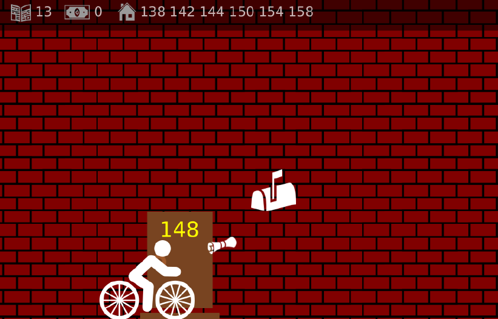

# Camelot à vélo — Delivery Game



**Camelot à vélo** is a Java-based 2D delivery game built with JavaFX. The player controls a bicycle-riding newspaper delivery person who must deliver newspapers to subscribed houses while managing movement, jumping, projectile physics, collisions, and an increasingly complex environment.

The game combines real-time gameplay with physics-based mechanics, procedural level generation, collision detection, camera movement, and electric-field simulation.

## Game Overview

The player controls a newspaper delivery rider travelling continuously through a street containing multiple houses.

The objective is to deliver newspapers to the correct mailboxes while avoiding unnecessary damage to windows and managing the limited number of newspapers available.

Each level generates a new street layout with:

* 12 houses
* Random house addresses
* Random newspaper subscriptions
* Random mailbox positions
* 0–2 windows per house
* A limited number of newspapers
* Increasingly complex gameplay as the levels progress

Starting from level 2, electrically charged particles are also generated throughout the level and affect the trajectory of thrown newspapers.

## Gameplay

The player continuously moves from left to right and cannot completely stop.

Newspapers can be thrown from the bicycle toward mailboxes and windows.

Successful deliveries to subscribed houses increase the player's earnings, while damaging the wrong windows can either result in a penalty or a reward depending on whether the house is subscribed.

The game continues through multiple procedurally generated levels until the player runs out of newspapers.

## Controls

| Key           | Action                              |
| ------------- | ----------------------------------- |
| `→`           | Accelerate                          |
| `←`           | Slow down                           |
| `Space` / `↑` | Jump                                |
| `Z`           | Throw a newspaper upward            |
| `X`           | Throw a newspaper forward           |
| `Shift + Z/X` | Throw with increased force          |
| `D`           | Toggle collision debugging          |
| `F`           | Toggle electric-field visualization |
| `I`           | Generate test electric particles    |
| `Q`           | Add 10 newspapers                   |
| `K`           | Set newspapers to zero              |
| `L`           | Skip to the next level              |
| `Esc`         | Exit the game                       |

## Core Gameplay Mechanics

### Newspaper Delivery

The player starts each level with additional newspapers. A newspaper is launched from the center of the rider and initially inherits the bicycle's velocity.

Different launch directions are available:

* **Upward throw (`Z`)**
* **Forward throw (`X`)**
* **Powered throw (`Shift`)**

The strength of a throw is calculated using the newspaper's mass and its initial momentum.

A minimum delay between throws prevents the player from launching all newspapers simultaneously.

## Physics System

The game uses a real-time physics system to simulate the movement of the rider and newspapers.

### Gravity

Gravity affects all moving objects in the game.

```text
ag = 1500 px/s²
```

Newspapers are affected by gravity throughout their trajectory, creating realistic projectile motion.

### Newspaper Mass

At the beginning of each level, newspapers receive a randomly generated mass between 1 kg and 2 kg.

The mass remains constant throughout the level.

### Velocity Limitation

To prevent unstable physics behaviour, the magnitude of a newspaper's velocity is limited to:

```text
1500 px/s
```

This is particularly important when electric forces are introduced at higher levels.

## Electric Field Simulation

Starting from level 2, the game introduces electrically charged particles distributed randomly throughout the level.

These particles create an electric field that affects the trajectory of newspapers.

Each particle has:

* A positive electric charge
* A fixed position
* A randomly generated colour
* No velocity
* No collision behaviour

The electric field at a given point is calculated by summing the contribution of every charged particle.

The resulting electric force is then converted into an acceleration applied to each newspaper.

The total acceleration of a newspaper is therefore:

```text
a = gravity + electric-field acceleration
```

This creates dynamic trajectories where newspapers can be pushed away from charged particles while travelling toward their targets.

## Procedural Level Generation

Each level is generated dynamically.

The game creates:

* 12 houses
* Sequential street addresses
* Randomly selected subscribed houses
* Random mailbox heights
* Random numbers of windows
* Random window configurations
* Charged particles from level 2 onward

House addresses are generated sequentially, with each house increasing by 2 from the previous address.

The first address is randomly selected within a predefined range.

The number of charged particles increases with the level:

```text
N = min((level - 1) × 30, 400)
```

This progressively increases the complexity of the electric-field simulation.

## Houses and Collisions

Each house contains a mailbox and may contain up to two windows.

### Mailboxes

When a newspaper collides with a mailbox:

* The newspaper disappears.
* A subscribed mailbox turns green.
* A successful delivery earns `$1`.
* An unsubscribed mailbox turns red.
* Delivering to an unsubscribed house does not earn money.
* A mailbox already hit by another newspaper cannot generate another reward.

### Windows

Newspapers can also collide with windows.

Breaking a window produces different financial consequences:

| House          | Result       |
| -------------- | ------------ |
| Subscribed     | `$2` penalty |
| Not subscribed | `$2` reward  |

Broken windows cannot generate additional financial effects when hit again.

## Camera System

The game uses a scrolling camera that follows the rider as they progress through the level.

The camera continuously adjusts its position so that the rider remains around 20% of the screen width from the left side.

This allows the player to see upcoming houses, mailboxes, windows, and obstacles while maintaining a consistent gameplay perspective.

## Character Animation

The rider is animated using two alternating images.

The animation switches between the two frames every 0.25 seconds based on the total elapsed game time.

This creates a simple continuous cycling animation while the bicycle is moving.

## Debugging Tools

The game includes an integrated debugging system designed to visualize and test the underlying gameplay mechanics.

### Collision Debugging

Pressing `D` displays collision rectangles around important objects such as:

* Newspapers
* Mailboxes
* Windows

A vertical reference line is also displayed at 20% of the screen width to verify that the camera is correctly positioned.

### Electric Field Visualization

Pressing `F` displays the electric field as arrows across the level.

The field is evaluated at regular points throughout the game world, allowing the direction and relative strength of the electric forces to be visually inspected.

### Test Particles

Pressing `I` replaces the existing particles with two test rows of equally spaced charged particles.

This provides a controlled environment for verifying the electric-field calculations.

### Gameplay Debugging

Additional keyboard shortcuts allow specific gameplay states to be tested quickly:

* `Q` adds newspapers.
* `K` removes all remaining newspapers.
* `L` advances directly to the next level.

## Game Progression

The game is divided into levels.

At the beginning of each level:

1. A loading screen is displayed.
2. The rider receives additional newspapers.
3. A new street layout is generated.
4. New houses and subscriptions are created.
5. New electric particles are generated from level 2 onward.
6. The rider starts from the beginning of the level.

A level is completed once the rider passes the final house by a sufficient distance.

The game ends when the player has no newspapers remaining and no newspapers are still active on screen.

A final screen displays the total amount of money accumulated during the game before restarting from level 1.

## Object-Oriented Design

The project was designed around object-oriented programming principles.

The game separates the JavaFX rendering and animation components from the underlying gameplay logic.

Core gameplay systems include:

* Player movement
* Newspaper physics
* Collision detection
* House generation
* Mailbox and window behaviour
* Level generation
* Camera management
* Electric-field calculations
* Debugging systems

This separation makes it possible to manage the game's different systems independently while keeping the real-time JavaFX rendering loop focused on updating and displaying the game.

## Technology Stack

* **Java**
* **JavaFX**
* **JavaFX Canvas**
* **Object-Oriented Programming**
* **2D Physics**
* **Collision Detection**
* **Procedural Generation**
* **Vector Mathematics**
* **Electric Field Simulation**
* **IntelliJ IDEA**
* **Gradle**
* **Git / GitHub**

## Project Structure

```text
Delivery-game/
├── Camelot/
│   └── ...
└── README.md
```

The `Camelot` directory contains the main application source code and game resources.

## Physics and Mathematics

The project combines several mathematical and physical concepts:

### Kinematics

Object movement is calculated from velocity and acceleration over time.

### Momentum

Newspaper launches use the relationship:

```text
p = m × v
```

The initial velocity of a newspaper is calculated from the rider's velocity and the additional momentum applied by the throw.

### Gravity

```text
ag = 1500 px/s²
```

### Electric Fields

The electric field produced by each charged particle is calculated based on its charge and distance from the newspaper.

The total field is obtained by summing the contribution of all particles.

### Vector Mathematics

The project uses two-dimensional vectors for:

* Position
* Velocity
* Acceleration
* Momentum
* Electric-field direction
* Electric forces

## Performance Considerations

The electric-field simulation requires calculating the contribution of multiple charged particles for each newspaper during each game update.

As the level increases, the number of particles grows, making the physics simulation progressively more computationally demanding.

The velocity limit on newspapers also helps prevent unstable or excessively large movements caused by strong electric forces.

## Project Highlights

* 🎮 Real-time 2D gameplay
* 🚲 Continuous bicycle movement
* 📰 Physics-based newspaper throwing
* 🏠 Procedurally generated houses
* 📬 Mailbox delivery system
* 🪟 Destructible windows
* 💰 Dynamic scoring and financial system
* ⚡ Electric-field physics
* 🧲 Vector-based force calculations
* 📷 Scrolling camera system
* 🐛 Integrated debugging tools
* 🎨 Animated character
* 🔄 Multi-level progression
* 🧱 JavaFX Canvas rendering

## Project Repository

The complete source code is available on GitHub:

**MikailKTC / Delivery-game**

## Summary

**Camelot à vélo** combines Java programming, JavaFX game development, object-oriented design, physics simulation, vector mathematics, collision detection, procedural generation, and real-time rendering into a complete 2D delivery game.

The project demonstrates how multiple independent systems—gameplay, physics, rendering, input handling, procedural generation, and debugging—can be integrated into a single interactive application.
